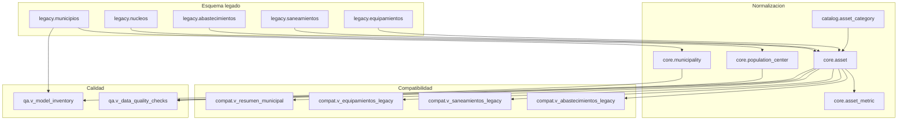

# EIEL Data Model Modernization Lab

Plataforma demostrable para analizar, rediseñar y validar la modernización del modelo de datos EIEL sobre **PostgreSQL/PostGIS**, con foco en la compatibilidad con aplicaciones existentes y la generación de entregables técnicos reutilizables en una licitación.

## Objetivo

Este proyecto materializa una propuesta técnica alineada con el pliego de actualización y optimización del modelo de datos EIEL. Incluye:

- inventario del modelo legado y detección de redundancias;
- diseño de un modelo lógico y físico normalizado;
- migración reproducible desde un esquema legado hacia un esquema objetivo;
- vistas de compatibilidad para facilitar la transición de SITMAP y del plugin EIEL de QGIS;
- controles de calidad de datos, validaciones de integridad e índices espaciales;
- documentación técnica y plantillas editables para la documentación exigida en oferta.

## Arquitectura



## Inicio rapido

### Requisitos previos

- Docker Engine 24+
- Docker Compose v2+
- 2 GB RAM libres como minimo
- 1 puerto libre para PostgreSQL local, por defecto `5433`

### Despliegue

```bash
# 1. Copiar variables de entorno
cp .env.example .env

# 2. Levantar la base de datos de laboratorio
docker compose up -d

# 3. Aplicar el modelo objetivo y las vistas de compatibilidad
bash scripts/run_migrations.sh

# 4. Validar el resultado
bash tests/test_migration.sh
```

En Windows PowerShell también se incluyen scripts nativos:

```powershell
Copy-Item .env.example .env
./scripts/bootstrap_lab.ps1
./tests/test_migration.ps1
```

## Validaciones incluidas

- equivalencia de recuentos entre tablas legadas y vistas de compatibilidad;
- comprobación de errores bloqueantes de calidad de datos;
- presencia de índices espaciales en el modelo normalizado;
- inventario de entidades para trazabilidad de la migración.

## Estructura del proyecto

```text
.
|-- docker-compose.yml
|-- postgres/
|   |-- init/
|   |   |-- 01-extensions.sql
|   |   |-- 02-legacy-schema.sql
|   |   '-- 03-legacy-sample-data.sql
|   '-- migrations/
|       |-- 001_target_model.sql
|       |-- 002_compatibility_views.sql
|       '-- 003_quality_checks.sql
|-- scripts/
|   |-- bootstrap_lab.sh
|   |-- bootstrap_lab.ps1
|   |-- run_migrations.sh
|   '-- run_migrations.ps1
|-- tests/
|   |-- test_migration.sh
|   '-- test_migration.ps1
|-- docs/
|   |-- arquitectura.md
|   |-- analisis-modelo-actual.md
|   |-- modelo-datos.md
|   |-- diccionario-datos.md
|   |-- migracion-y-compatibilidad.md
|   '-- operacion-y-mantenimiento.md
|-- templates/
|   |-- declaracion-responsable.md
|   |-- relacion-trabajos.md
|   |-- memoria-tecnica-licitacion.md
|   '-- perfil-equipo.md
 '-- .github/workflows/ci.yml
```

## Documentacion tecnica

- [Arquitectura](docs/arquitectura.md)
- [Analisis del modelo actual](docs/analisis-modelo-actual.md)
- [Modelo de datos objetivo](docs/modelo-datos.md)
- [Diccionario de datos](docs/diccionario-datos.md)
- [Migracion y compatibilidad](docs/migracion-y-compatibilidad.md)
- [Operacion y mantenimiento](docs/operacion-y-mantenimiento.md)

## Documentacion de oferta

La carpeta `templates/` contiene plantillas editables para la parte documental de la licitación. Estan redactadas para ser **completadas con datos reales del licitador**, evitando inventar referencias, experiencia o perfiles no acreditables.

## Estado actual

El laboratorio ya dispone de:

- esquema legado con datos de ejemplo;
- modelo objetivo normalizado;
- vistas de compatibilidad;
- controles de calidad e inventario;
- automatizacion local y CI.

El siguiente paso natural es adaptar las plantillas y, si se dispone del esquema real EIEL, sustituir el dataset de laboratorio por el inventario real para enriquecer el analisis y el benchmarking.
