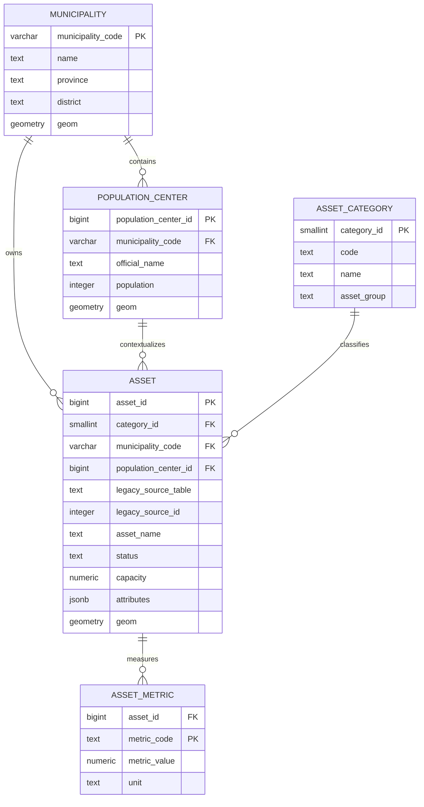

# Modelo de Datos Objetivo

## Modelo conceptual

## Decisiones de modelado

### Entidad `core.asset`

Se adopta una tabla unica para infraestructuras y equipamientos porque:

- reduce tablas paralelas;
- permite reutilizar lógica comun de estado, geometria y adscripcion territorial;
- simplifica consultas de inventario y exportacion.

### Metricas desacopladas

Valores como caudal, capacidad o poblacion servida se trasladan a `core.asset_metric`, evitando columnas especializadas vacias para la mayor parte de filas.

### Atributos variables en JSONB

Los atributos diferenciales de cada dominio se conservan en `attributes`, lo que permite migrar sin perder semantica y sin inflar el modelo fisico con columnas de baja estabilidad.

### Trazabilidad de origen

Cada activo mantiene `legacy_source_table` y `legacy_source_id`, lo que permite:

- reconstruir el mapeo legado -> nuevo modelo;
- depurar migraciones;
- auditar incidencias durante la transicion.

## Reglas de negocio implementadas

- Un municipio puede tener cero o muchos nucleos.
- Un activo pertenece exactamente a un municipio.
- Un activo puede asociarse opcionalmente a un nucleo.
- Toda categoria debe estar registrada en `catalog.asset_category`.
- Cada metrica es unica por `asset_id + metric_code`.
